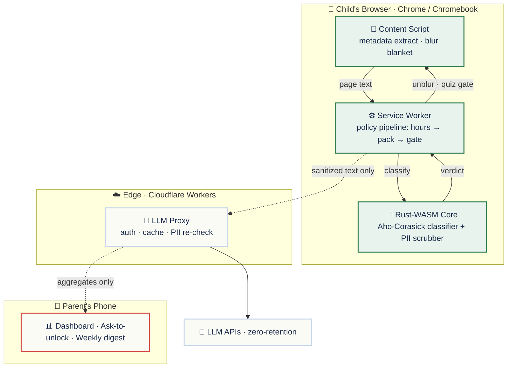
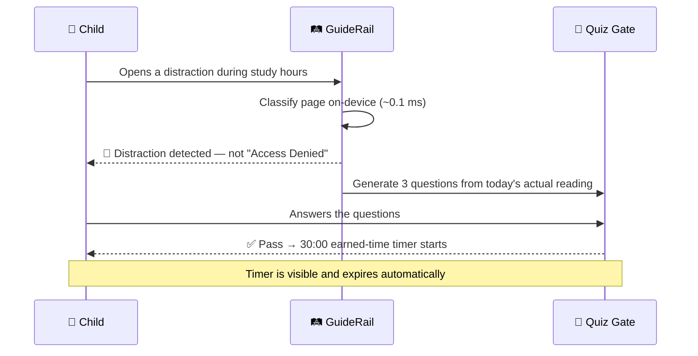

<div align="center">

# 🛤️ GuideRail

### The study browser that turns blocked pages into learning — and screen time into a reward.

*It knows your child's syllabus, allows the schoolwork, and quizzes the distractions.*
**No spying, no shouting.**


</div>

---

## 📖 The idea in one sentence

Most safety tools stop at **“Access Denied.”** GuideRail treats a blocked page as the most teachable second of the day: answer three questions from what you actually read this morning, and thirty minutes of earned time is yours — visible, honest, automatic.

> **Guardrails that *guide*, not gates that block.** A gate stops you. A guide rail runs alongside the road, lets you travel fast, and quietly keeps you from going over the edge.

---

## ✨ What makes it different

| | Feature | What it means |
|---|---|---|
| 🧭 | **Curriculum-aware filtering** | Schoolwork sites and topics just work — no false blocks on anatomy diagrams or history research. |
| 🎯 | **The quiz gate** | Distraction sites during study hours show 3 questions from that day's reading — not a dead end. |
| ⏱️ | **Earned time** | Pass the quiz → a visible 30-minute timer. Expires on its own. No parent in the loop. |
| 🔒 | **Private by architecture** | Classification runs **on the device**. Nothing to upload means nothing to leak. |
| 🖼️ | **Blur-by-default safety** | Unknown sites load blurred; JS *removes* blur only after validation — fail-safe, not fail-open. |
| 👀 | **Rules the child can see** | Every rule that applies to a child is visible *to that child*, in plain language. |

---

## 🏛️ Architecture

Three surfaces, one invariant: **raw child data never crosses the dotted line.**



> 🧱 **Invariants that hold in every phase**
> - No raw child data crosses the dotted line — `sanitize()` in the Rust core is the only exit.
> - The client is never trusted for entitlements; the server is never trusted with personal data.
> - **Filtering works with the entire right half of this diagram turned off.**

---

## 🦀 Why Rust + WebAssembly

GuideRail's classifier is written in **pure Rust, compiled to WebAssembly**, and runs inside the browser's own service worker. It's the load-bearing bet the whole product rests on — so here's the reasoning, the decision, the impact, and the receipts.

### 🤔 Reasoning

- Every feature depends on one claim: curriculum keyword matching **and** personal-data scrubbing can run **on-device, in real time**, without ever phoning home.
- The budget is unforgiving — **under 16.6 ms** (one animation frame) per operation, even on a ₹15,000 Chromebook — because a study tool that stutters the browser is a study tool that gets uninstalled.
- Doing this on a server would ship a child's browsing off-device: slower, costlier per request, and fatal to the privacy promise.

### 🧭 Decision

- **Pure-Rust core** behind a razor-thin `wasm-bindgen` boundary — just two exported functions, `classify()` and `sanitize()` — so the logic stays unit-testable with plain `cargo test`, no browser required.
- Keyword matching uses **`aho-corasick`**: one automaton walk in `O(text + matches)` no matter how many *thousands* of keywords a pack carries — never a regex-per-keyword loop.
- Personal-data scrubbing uses **`regex-lite`** (the full `regex` crate alone added ~250 KB to the binary), applied longest-match-first at the **single** network-egress choke point.
- Release build tuned for size: `opt-level="s"` · `lto` · `codegen-units=1` · `panic="abort"`.

### 💥 Impact

- 🔒 **Privacy is structural, not a pinky-promise** — classification never leaves the device, so *“we never receive children's data”* is architecture, not policy.
- 💸 **Zero per-classification server cost** — the freemium model works because the hot path never touches a server.
- 📴 **Fully offline** — filtering keeps running with no network at all.
- 🧪 **Host-testable core** — pure-Rust logic runs under `cargo test` with no WASM runtime in the loop.

### 📊 Result — and yes, we're bragging

> ⚡ **Warm-path classification: `0.1 ms` at p95 — roughly _50× under_ its 5 ms budget.**
> Measured in a **real Chrome service worker** (not Node, which flatters WASM by ~30%), on a **2013-era Intel i7 laptop**. On active browsing, classification is effectively *free*.

| Metric | Result | Budget | Verdict |
|---|---|---|---|
| 🏃 Warm-path classify (p95) | **0.1 ms** · p99 0.2 ms | `< 5 ms` | **~50× under** ✅ |
| ❄️ Cold-start (cached worker wake) | **42.8 ms** | `< 50 ms` | under ✅ |
| 🧱 Automaton build · 10k keywords | **~83 ms** | `< 100 ms` | under ✅ |
| 📦 WASM core, gzipped | **116 KB** *(86.5 KB with `wasm-opt`)* | `< 200 KB` | under ✅ |
| 🪶 Total install footprint | **< 5 MB** | — | smaller than one WhatsApp photo |

📐 Full rationale + the honest caveats we track: [`ADR-0003`](docs/adr/0003-classification-architecture.md)

---

## 🧩 How the quiz gate works



---

## 🧠 Curriculum packs

A parent picks **“Class 7 · CBSE”** once, and the extension knows what schoolwork means for that child. Packs are **data, not code** — a content drop, never a release.

- 📦 A pack is a single validated **JSON file**: allowed domains, curriculum keywords, YouTube channels, and quiz topics.
- 🚀 Keywords compile into an **Aho-Corasick automaton at load** — a single-pass, multi-pattern matcher — cached per session and rebuilt only on pack change.
- 🛡️ Every pack is validated before it can activate; an invalid update **keeps the previous pack**, so filtering never bricks.
- 🔁 Activation is an **atomic swap** in `chrome.storage.local`.

| Seed pack | Board | Grade | Ships with |
|---|---|---|---|
| `cbse-class7` | CBSE | Class 7 | 300+ keywords · 50+ domains · curated channels |
| `icse-class7` | ICSE | Class 7 | 300+ keywords · 50+ domains · curated channels |
| `homeschool-general` | General | Class 7 | 300+ keywords · 50+ domains · curated channels |

```jsonc
{
  "id": "cbse-class7",
  "version": "1.0.0",
  "board": "CBSE",
  "grade_band": "7",
  "tags": ["math", "science", "history", "english"],
  "allow_domains": ["khanacademy.org", "ncert.nic.in", "diksha.gov.in"],
  "allow_keywords": [{ "term": "photosynthesis", "tag": "science" }],
  "allow_yt_channels": [{ "channel_id": "UC...", "label": "Khan Academy India", "subjects": ["math"] }],
  "quiz_topics": ["fractions", "the water cycle"]
}
```

📚 Full field reference: [`docs/pack-schema.md`](docs/pack-schema.md) · design rationale: [`ADR-0004`](docs/adr/0004-pack-format-and-trust.md)

---

## 🔒 Privacy model

**Private by architecture, not by promise.**

- ✅ Filtering runs **locally** — the classifier is a deterministic engine inside the device that works offline.
- ✅ **No child accounts** anywhere.
- ✅ Personal details are **scrubbed on-device** (`sanitize()`) before any text can leave.
- ✅ Every AI-written quiz question must carry a **verified snippet** from the page the child actually read, or it is discarded.
- 🚫 No message reading. No location tracking. No social-media monitoring. Study hours only.

---

## 🗺️ Roadmap

| Phase | Name | Headline | Tier |
|---|---|---|---|
| 1️⃣ | **Private Beta** | Study hours that work — single child, curriculum-aware filtering, the quiz gate, earned time | Free |
| 2️⃣ | **Family Launch** | One dashboard, all your kids — profiles, schedules, ask-to-unlock, weekly digest, worksheet engine | Family plan |
| 3️⃣ | **Community** | Your co-op, one standard — shared allowlists, more curriculum packs, Hindi/Hinglish, Edge support | Co-op plan |
| 4️⃣ | **Institutional** | Managed at scale — force-install, fail-closed profile, admin console, teacher view, data-residency | B2B |

📈 Detail: [`docs/ROADMAP.md`](docs/ROADMAP.md)

---

## 🚀 Getting started

### Prerequisites

- 🟢 **Node.js** 20+ and **pnpm**
- 🦀 **Rust** toolchain + [`wasm-pack`](https://rustwasm.github.io/wasm-pack/)
- 🌐 **Chrome** (Manifest V3) for loading the unpacked build

### Install & build

```bash
pnpm install                                                  # workspace deps
wasm-pack build packages/core-wasm --target web --release     # build the Rust core
pnpm build                                                    # build all packages (turbo)
pnpm ext:dev                                                  # load unpacked into Chrome w/ hot reload
```

### Common commands

| Command | What it does |
|---|---|
| `pnpm build` | Build all packages via Turborepo |
| `pnpm test` | Vitest (TypeScript) + `cargo test` (Rust) |
| `pnpm bench:wasm` | Cold/warm-path benchmark → `bench/results/` |
| `pnpm ext:dev` | Load the unpacked extension into Chrome with hot reload |
| `wasm-pack build packages/core-wasm --target web --release` | Rebuild the WASM core |

---

## 📂 Project structure

```text
guiderail/
├── packages/
│   ├── core-wasm/      🦀 Rust classifier + PII scrubber → WebAssembly
│   ├── extension/      🧩 MV3 shell: service worker, content scripts, curriculum packs
│   └── quiz-engine/    📝 Quiz generation & gating logic
├── services/
│   └── llm-proxy/      ☁️ Edge proxy: auth · cache · PII re-check
├── specs/              📋 One spec per feature — implementation builds FROM the spec
└── docs/
    ├── adr/            🏛️ Architecture Decision Records
    ├── pack-schema.md  📚 Curriculum pack contract
    └── ROADMAP.md      🗺️ Phased, user-visible roadmap
```

---

## 🏛️ Design decisions

Every architectural decision is recorded as an **ADR** — no silent decisions.

| ADR | Decision |
|---|---|
| [0001](docs/adr/0001-fail-open-fail-closed-config.md) | Fail-open vs fail-closed is a per-profile configuration |
| [0003](docs/adr/0003-classification-architecture.md) | Classify in Rust-WASM with Aho-Corasick; scrub PII at one choke point |
| [0004](docs/adr/0004-pack-format-and-trust.md) | Curriculum packs are bundled JSON, hand-validated, with a reserved trust envelope |
| [0006](docs/adr/0006-llm-proxy-stack.md) | LLM proxy: TypeScript on Cloudflare Workers |

---

## 📄 License

Licensed under **MIT OR Apache-2.0**.

<div align="center">

---

*Filtering tools don't teach. Teaching tools don't protect. **GuideRail does both.***

</div>
